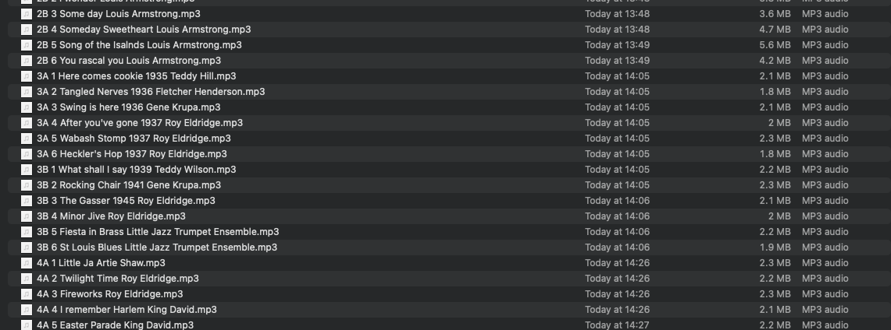

# All that jazz

**Extract metadata from WAV filenames for import into Apple Music**

This is a worked example of extracting metadata from WAV filenames for import into Apple Music.

While q is best known as for writing queries on kdb+ datasets, it is also a general-purpose programming language, and well-suited to exploratory programming and general hacking. 

This work is documented in the article “All That Jazz” in [`docs/index.md`](./docs/index.md), first published at [5jt.com](https://www.5jt.com/all-that-jazz-the-librarian-s-song).
It demonstrates some features of functional vector programming.

